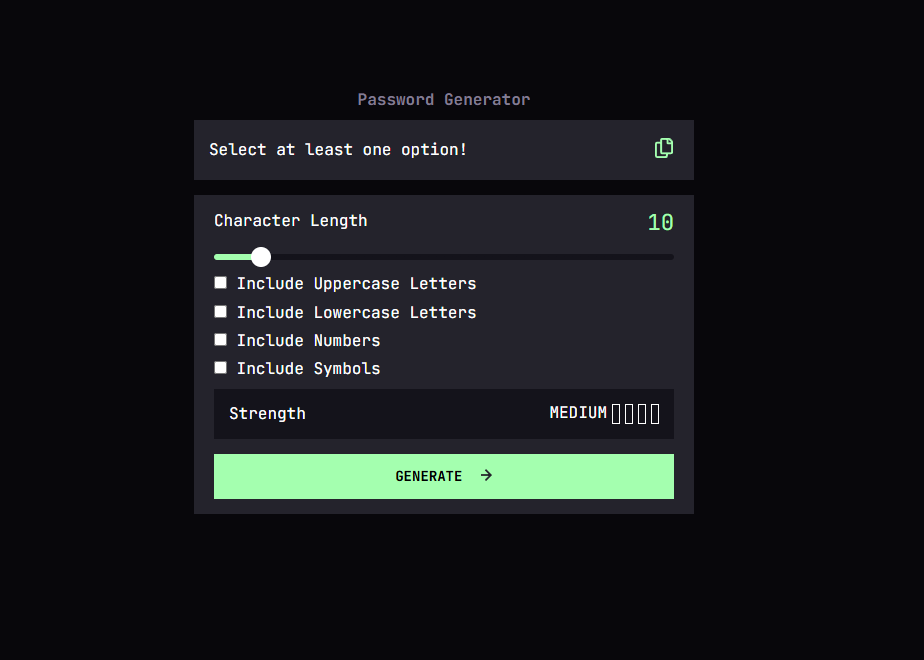

# Frontend Mentor - Password generator app solution

This is a solution to the [Password generator app challenge on Frontend Mentor](https://www.frontendmentor.io/challenges/password-generator-app-Mr8CLycqjh). Frontend Mentor challenges help you improve your coding skills by building realistic projects.

## Table of contents

- [Overview](#overview)
  - [The challenge](#the-challenge)
  - [Screenshot](#screenshot)
  - [Links](#links)
- [My process](#my-process)
  - [Built with](#built-with)
  - [What I learned](#what-i-learned)
  - [Continued development](#continued-development)
  - [Useful resources](#useful-resources)
- [Author](#author)
- [Acknowledgments](#acknowledgments)

## Overview

### The challenge

Users should be able to:

- Generate a password based on the selected inclusion options
- Copy the generated password to the computer's clipboard
- See a strength rating for their generated password
- View the optimal layout for the interface depending on their device's screen size
- See hover and focus states for all interactive elements on the page

### Screenshot

### Links

- Solution URL: [Github](https://github.com/Yeounng/Frontend-Mentor-Junior/tree/password-gen)
- Live Site URL: [Netlify](https://bespoke-paletas-4c12fe.netlify.app/)

## My process

### Built with

- Semantic HTML5 markup
- CSS custom properties
- Flexbox
- CSS Grid
- Mobile-first workflow
- [ClipboardJS](https://clipboardjs.com/) - ClipboardJS

**Note: These are just examples. Delete this note and replace the list above with your own choices**

### What I learned

자바스크립트에 조금 더 익숙해진거같다.

함수도 여러개를 작성했고. 특히 효율적으로 가장 엔트로피가 높게끔 조건에 맞는 비밀번호를 생성하려면 어떤 방법을 써야할지 고민을 많이했다.
문자열을 지정해놓고 조건에 맞으면 이 문자열들을 다 합친다음에 charAt(Math.floor(Math.random) \* string.length)로 반복 돌려서 만약 안나오면 나올때까지 다시 생성하게 하려고 하기도 했다가... 버리고 조건에 맞춰서 각각 문자열에서 문자를 가져와서 합치려고 했더니 비밀번호 자릿수가 문제여서 생각하고..

아무튼 만들어본 적 없기도하고 쉽게 떠오르지 않았는데 어찌저찌 괜찮은 방법을 찾아서 만들었다. Length라고 써야하는걸 Lenght라고 쓰고 오타를 못찾기도 했음 ㅠ

input range를 스타일링하는데 기본 스타일 appearence:none 후 백그라운드로 색을 정하고 스타일링했더니 웬걸, 전체가 같은색이 아니였다.
슬라이드된쪽은 초록, 아직 안된쪽은 검은색이였던것.. linear-gradient를 쓰고 slider thumb위치를 백분율로 뽑아서 background에 적용하게 짜면된다.
linear-gradient는 img 속성이라 background-color 에는 적용이 안되고 background로 써야한다고 함.

이래저래...

지식이늘었다!

### Useful resources

- [여러종류의 MDN docs를 참고하고 그랬다](https://developer.mozilla.org/ko/docs/Web/JavaScript/Reference) - charAt(),push(),join(),Math.floor().Math.round(),Math.random,string.includes(),
- [Fisher-Yates 셔플 알고리즘](https://velog.io/@wjdals189/Fisher-Yates-Shuffle-%EC%95%8C%EA%B3%A0%EB%A6%AC%EC%A6%98) - 마지막에 생성된 배열을 한번 섞어서 랜덤성을 강화하고 join()으로 문자열로 합쳐줄때 썼다

## Author

- Website - [Add your name here](https://www.your-site.com)
- Frontend Mentor - [@yourusername](https://www.frontendmentor.io/profile/yourusername)
- Twitter - [@yourusername](https://www.twitter.com/yourusername)

**Note: Delete this note and add/remove/edit lines above based on what links you'd like to share.**

## Acknowledgments

This is where you can give a hat tip to anyone who helped you out on this project. Perhaps you worked in a team or got some inspiration from someone else's solution. This is the perfect place to give them some credit.

**Note: Delete this note and edit this section's content as necessary. If you completed this challenge by yourself, feel free to delete this section entirely.**
